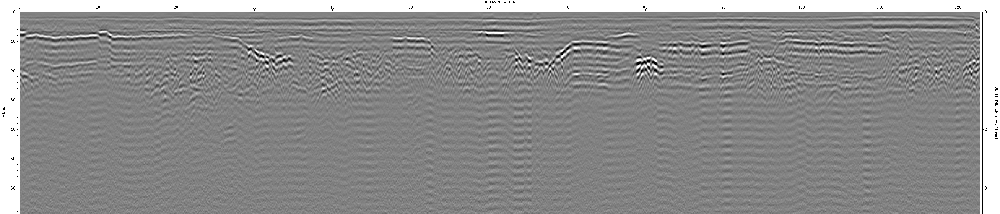

# GPR Image Dataset for End-to-End Frequency Enhancement

This repository contains a dataset specifically curated for the task of End-to-End Frequency Enhancement for Ground Penetrating Radar (GPR) Images using Domain-Adaptive Generative Adversarial Networks (DAGAN). This dataset is designed to aid researchers and practitioners in developing and testing models that enhance the frequency content of GPR images, facilitating improved subsurface imaging and analysis.

## Dataset Description

The dataset includes GPR images captured using a **pulseEKKO GPR device operating at 800 MHz**. The data collection was conducted in various locations, including:

- An experimental road segment of **400 meters on G320 Bada Road in Jinhua, Zhejiang**
- Various municipal roads

Each image in the dataset has been annotated for target detection, with labels for the following categories:

- **Voids**
- **Cracks**
- **Moisture**
- **Pipelines**
- **Loose areas**

### Key Characteristics

- **Number of Images:** 600
- **Frequency:** 800 MHz
- **Annotations:** Ground truth frequency content and labels for voids, cracks, moisture, pipelines, and loose areas

The dataset includes metadata files that describe the image properties and annotations in detail.

## Sample Image

Here is a sample image from the dataset:

## Access to the Dataset

The dataset will be made available upon the acceptance of the paper titled **"End-to-End Frequency Enhancement for GPR Images Using Domain-Adaptive Generative Adversarial Networks"**. If you are interested in obtaining access to this dataset, please contact the author via email:

- **Author:** Zhang
- **Email:** [zhang@isac.rwth-aachen.de](mailto:zhang@isac.rwth-aachen.de)

Please include your name, affiliation, and a brief description of your research interest in the email.

## Contact

For any further questions or inquiries, feel free to reach out to the author at [zhang@isac.rwth-aachen.de](mailto:zhang@isac.rwth-aachen.de).

---

We hope this dataset proves valuable for your research and development in the field of GPR image enhancement. Thank you for your interest!
